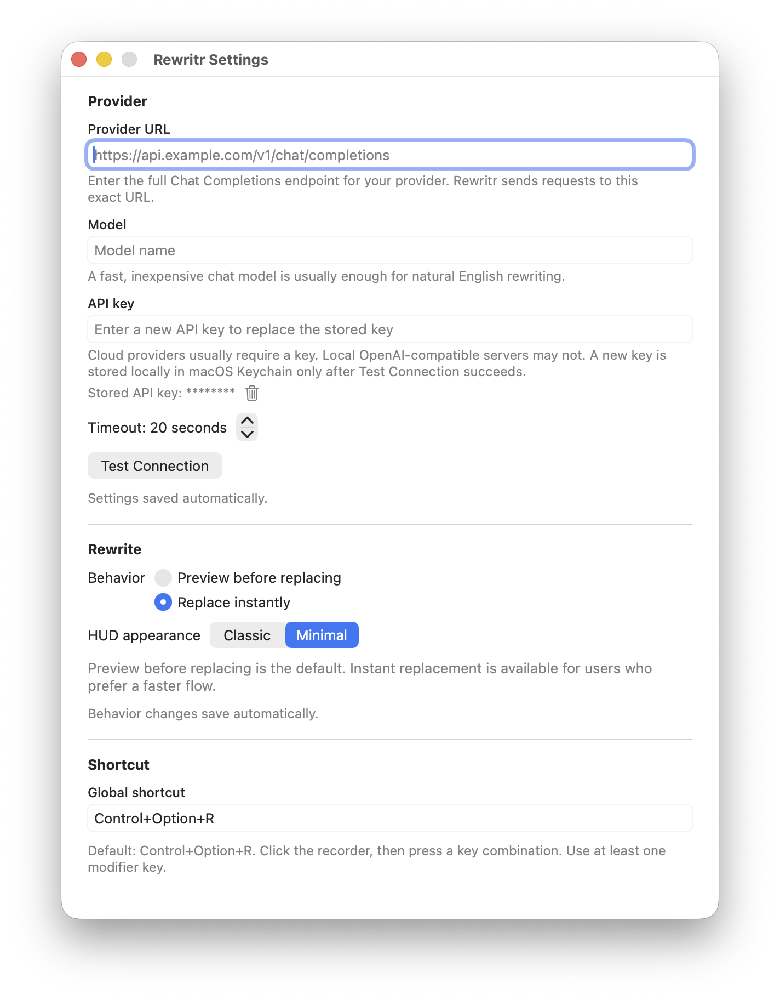
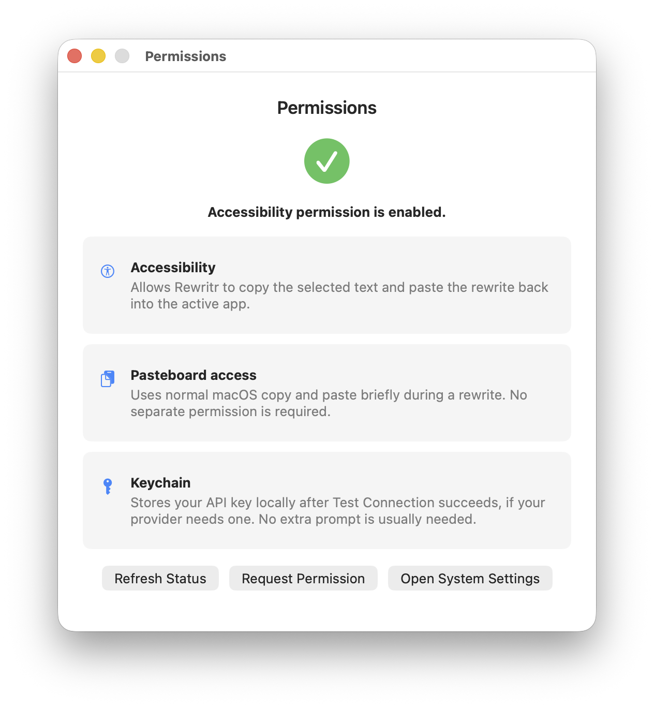
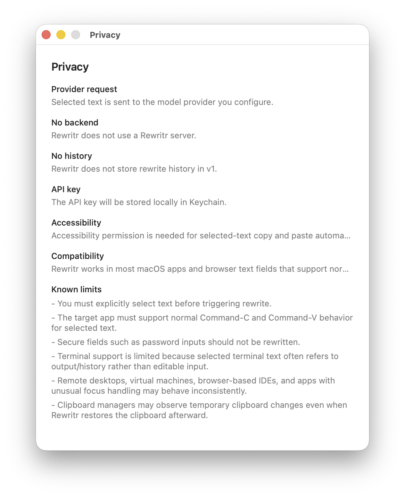

# Rewritr

[](https://github.com/jameswei/rewritr/actions/workflows/ci.yml)

语言：[English](README.md) | 简体中文 | [繁體中文](README.zh-TW.md) | [日本語](README.ja.md)

<p align="center">
  
</p>

**项目网站：** https://lifeplayer.space/rewritr/

Rewritr 是一个隐私优先的原生 macOS 菜单栏应用，面向希望把英文写得更自然、更顺畅、更接近母语表达的非英语母语用户。

它刻意保持小而专注：在其他应用里选中英文文本，触发 Rewritr，然后用更清晰自然的版本替换原文。Rewritr 会尽量保留原意，避免把内容改成学术论文式、过度正式、俚语化或充满废话的英文。

## 截图

<table>
  <tr>
    <td></td>
    <td></td>
  </tr>
  <tr>
    <td align="center"><em>设置</em></td>
    <td align="center"><em>权限设置</em></td>
  </tr>
  <tr>
    <td colspan="2" align="center"></td>
  </tr>
  <tr>
    <td colspan="2" align="center"><em>macOS 辅助功能权限</em></td>
  </tr>
</table>

## 下载

从 [GitHub Releases](https://github.com/jameswei/rewritr/releases) 下载最新版本。

当前发布包是未签名的 macOS app zip。解压后：

- 将 `Rewritr.app` 移动到稳定位置，例如 `/Applications`。
- 打开 Rewritr。
- 按提示授予辅助功能权限。
- 在 Settings 中配置你的 OpenAI-compatible provider。云端 provider 通常需要 API key；本地 OpenAI-compatible 模型可能不需要。

macOS 会把辅助功能权限授予到具体的 app bundle 路径。如果授权后移动了应用，可能需要重新授权。

## 工作方式

1. 在任意可编辑应用里选中英文文本。
2. 按 `Control+Option+R`。
3. Rewritr 通过 macOS 自动化复制选中的文本。
4. Rewritr 将文本发送到你配置的 OpenAI-compatible Chat Completions provider。
5. Rewritr 会先预览改写结果，或直接替换选中文本。

Rewritr 支持两种改写行为：

- `Preview before replacing`：先展示改写结果，再选择 `Replace`、`Copy`、`Retry` 或 `Dismiss`。
- `Replace instantly`：provider 返回结果后立即替换选中文本，并在工作过程中显示一个小的浮动状态 HUD。

菜单栏图标会显示轻量状态：

- `hourglass`：正在改写或替换
- `checkmark.circle`：替换成功
- `exclamationmark.triangle`：失败

## 隐私

你的隐私很重要，也应该掌握在你自己手里。Rewritr 没有后端服务，不保存选中文本、改写历史、分析数据或账号数据。

- 只有你明确选中的文本会被发送，而且只会发送到你配置的 provider endpoint。
- 如果你使用本地 OpenAI-compatible 模型，选中文本可以留在你自己的机器或网络里。
- 非敏感设置保存在 UserDefaults。
- 如果 provider 需要 API key，API key 会在 provider 测试成功后保存在本机 macOS Keychain。
- 剪贴板自动化会临时使用 macOS pasteboard，并在安全时恢复之前的剪贴板内容。

## 兼容性

Rewritr 适用于大多数支持正常复制粘贴的 macOS 应用和浏览器文本框。也有一些重要限制：

- 触发改写前必须明确选中文本。
- 目标应用必须支持对选中文本执行正常的 `Command-C` 和 `Command-V`。
- 不应该改写密码输入框等安全字段。
- Terminal 支持有限，因为终端里选中的文本通常是输出或历史记录，而不是可编辑输入。
- 远程桌面、虚拟机、浏览器 IDE，以及焦点处理方式特殊的应用可能表现不稳定。
- 剪贴板管理器可能会观察到临时剪贴板变化，即使 Rewritr 随后恢复了剪贴板。

## 开发要求

- macOS 15 或更新版本
- 支持 macOS app 构建的 Xcode

## 开发

用 Xcode 打开 `Rewritr.xcodeproj`，构建 `Rewritr` scheme。

本地构建：

```sh
xcodebuild -project Rewritr.xcodeproj -scheme Rewritr -configuration Debug -destination 'platform=macOS' -derivedDataPath /tmp/rewritr-dev-derived build CODE_SIGNING_ALLOWED=NO
```

构建测试：

```sh
xcodebuild -project Rewritr.xcodeproj -scheme Rewritr -configuration Debug -destination 'platform=macOS' -derivedDataPath /tmp/rewritr-dev-derived build-for-testing CODE_SIGNING_ALLOWED=NO
```

运行测试：

```sh
xcodebuild -project Rewritr.xcodeproj -scheme Rewritr -configuration Debug -destination 'platform=macOS' -derivedDataPath /tmp/rewritr-dev-derived test CODE_SIGNING_ALLOWED=NO
```

## 更新日志

参见 [CHANGELOG.md](CHANGELOG.md)。

## 发布

当推送 `v*` tag，或手动运行 `Release` workflow 时，GitHub Actions 会构建发布包。workflow 会将 `Rewritr.app` 打包成 zip，并附加到 GitHub Release，同时生成 SHA-256 校验和。
